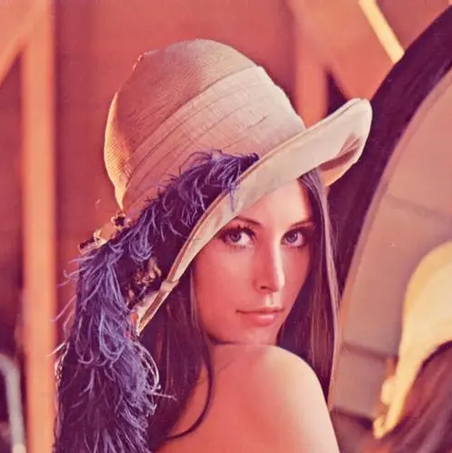

# BMP2YUV

一套简单的 Rust 代码用于将BMP格式图像转换为YUV格式。

使用此代码生成的YUV图像格式为 **YUV 4: 4: 4 8-bit packed**，请务必使用对应的解析方式打开。

## 使用方法

将待转换的BMP格式放置到`input_images`目录，在项目路径下启动终端，执行`cargo run`即可执行转换。

转换后的图像输出在`output_yuv`目录中。

## 运行效果截图

原图：

转换后效果（使用 **YUV 4: 4: 4 8-bit packed** 格式解析）：

